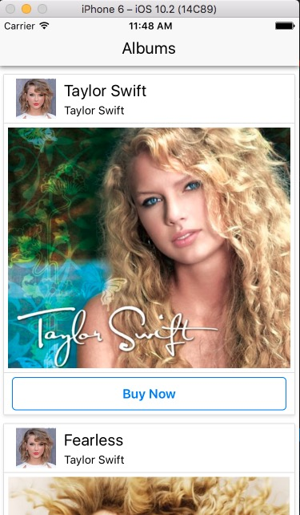

# RN Album Puchase
### Welcome to an app dedicated to Taylor Swift! The app fetches data from a 3rd party API and consumes the data to build a list of Taylor Swift albums with a link to purchase on Amazon.

Some of the things I used in building this application are

- [x] React
- [x] React-native
- [x] Axios
- [x] Functional Components
- [x] Class Based Components

I also got a really good feeling about how destructuring, props, styling, importing, and exporting with React Native is handled.
